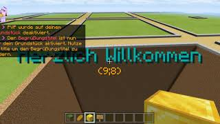

# MyPlot-Merge
Plot Merging System working by MyPlot for PocketMine-MP

# Server List
Server, that use my system:
- NoteLand: noteland.de 19132
- Hyperdraft: hyperdraft.de 19132

# How to use
1. Put the modify version of MyPlot and MyPlotMerge into your plugin folder
2. Start the server.

# Video Example

